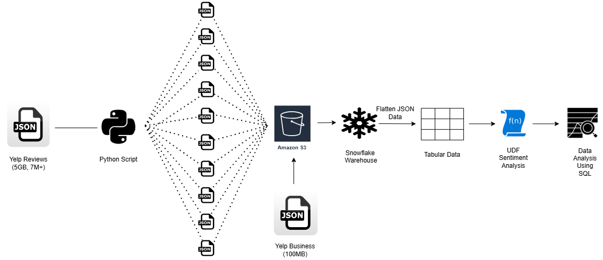

## 📄 Project Overview
This project focuses on building an end-to-end data pipeline for processing Yelp Review data, which will be used for sentiment analysis and business insight generation.
It covers data engineering tasks such as extraction, transformation, storage, and ingestion into Snowflake, followed by SQL-based analytics using a User-Defined Function (UDF) for sentiment classification.
At the final stage, data analysis was performed by answering 10 key business questions, utilizing SQL Window Functions, Subqueries, Joins, Common Table Expressions (CTEs), and Grouping techniques to extract meaningful insights from the processed data.

🔗 Dataset Source - [Yelp Open Dataset](https://business.yelp.com/data/resources/open-dataset/)

## 🛠️ Workflow Diagram

## Project Workflow Description
### 1. Data Extraction
- Extracted the Yelp Review Dataset (5GB, 7M+ rows) and Yelp Business Dataset (100MB) from the [Yelp Open Dataset](https://business.yelp.com/data/resources/open-dataset/).

- The datasets were in semi-structured JSON format.

### 2. Data Preparation (Splitting Large JSON File)
- Developed a Python program to split the Yelp Review JSON file into 10 smaller files (~500MB each) to make ingestion faster and manageable.

- Python script used: [split_large_json.py](./Scripts/split_large_file.py)

### 3. Data Storage (Amazon S3)
- Uploaded the split Review JSON files and Business JSON file into an Amazon S3 bucket.

- These files served as the source for ingestion into Snowflake.

### 4. Data Ingestion into Snowflake
- Established a secure connection between Amazon S3 and Snowflake by creating external stages using S3 credentials.

- Configured parallel ingestion of split files from S3 to Snowflake, leveraging Snowflake’s native support for efficient, parallelized loading of large datasets.

- Loaded data into RAW tables in Snowflake using the COPY INTO command, ensuring optimized and scalable data transfer from S3.

- Developed SQL scripts for loading the Yelp datasets:
  - [yelp_review_load.sql](./Snowflake_Queries/yelp_reviews_table.sql)
  - [yelp_business_load.sql](./Snowflake_Queries/yelp_business_table.sql)

### 5. Flattening JSON Structure (Snowflake)
- Flattened the nested JSON fields (especially reviews and business attributes) into a relational table structure using FLATTEN function.

- SQL script to flatten the JSON into tabular format:
  - [yelp review flatten](./Snowflake_Queries/yelp_reviews_table.sql)
  - [yelp business flatten](./Snowflake_Queries/yelp_business_table.sql)

### 6. Sentiment Analysis (UDF Creation)
- Created a Python UDF inside Snowflake to classify reviews as positive or negative.
- Python UDF based on simple NLP sentiment logic.
- The UDF was used to create a new column in the dataset that labels each review as either positive or negative.
- SQL script for UDF creation:  [sentiment_udf.sql](./Snowflake_Queries/analyze_sentiment_udf.sql) 

### 7. Data Analysis Using SQL
- Used Window Functions, CTEs, Joins, and Subqueries to perform deep data analysis.

- Answered 10 business-driven questions using SQL.

- SQL script containing the analysis queries: [answer_10_questions.sql](./Snowflake_Queries/answer_10_questions.sql)
